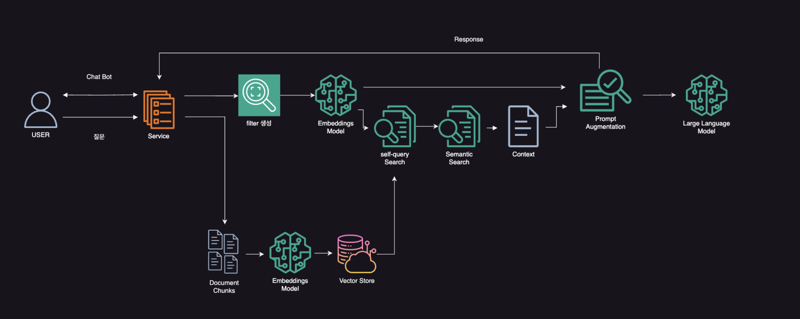
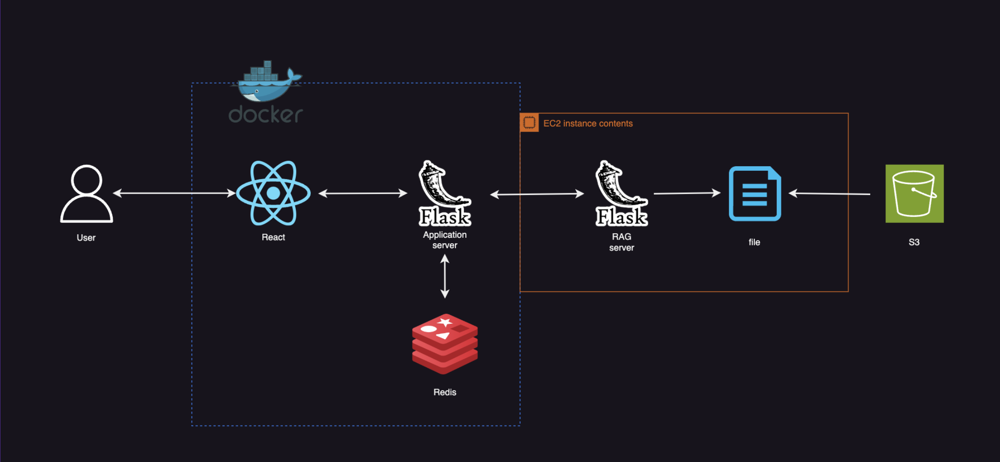
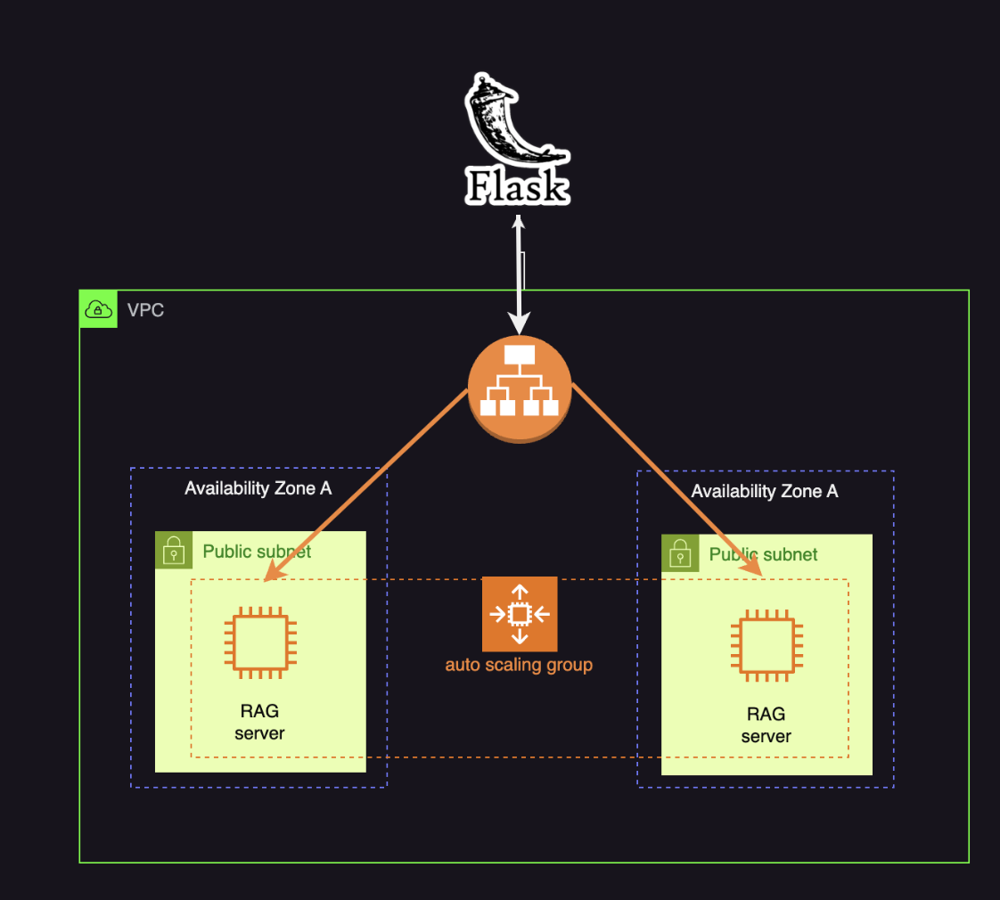
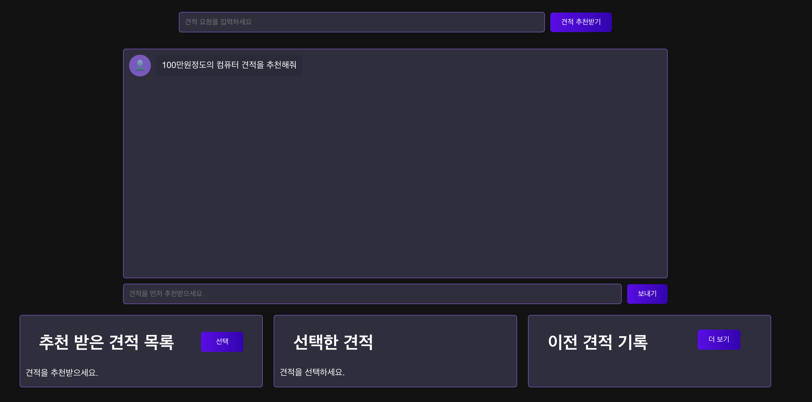
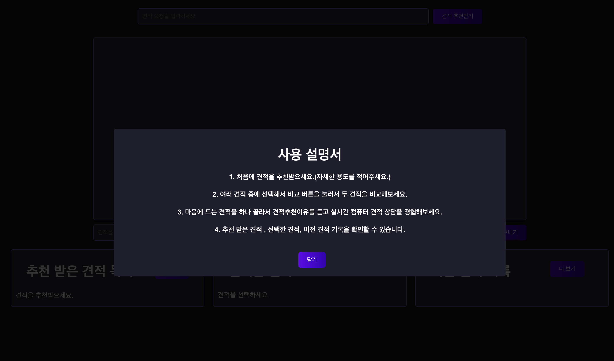

# 2024년 상명대학교 졸업 작품

# 팀명 : 또 너야

# 프로젝트명 : 고급RAG와 LLM파인튜닝을 이용한 컴퓨터견적 추천 및 분석서비스

# 프로젝트 간단한 설명 : 고급 RAG를 이용하여 사용자의 질문에 맞는 컴퓨터 견적을 추천해주고 컴퓨터 분석 및 부품에 대해 파인튜닝한 LLM이 견적에 대한 분석적 견해를 주어 보다 사용자들이 가볍게 사용하기 좋은 웹서비스

# 발표자료 : https://www.canva.com/design/DAGFxJRxeDM/4zIwLJVxIgerQLW89zXZ6Q/edit

# 시스템 아키텍처

## 1. RAG & LLM

## 2. WEB

## 3. 클라우드

### 역할분담

- 프론트엔드,RAG(랭체인) : 박준혁
- 백엔드(플라스크),LLM파인튜닝, : 신동훈,최재우

### 화면 구성

