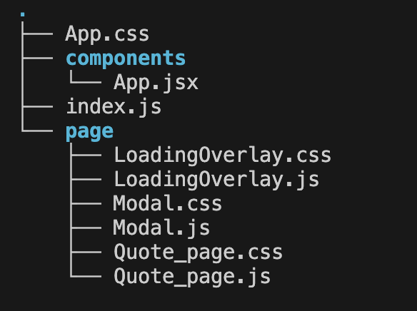

# 2024년 상명대학교 졸업 작품

## 팀명 : 또 너야

## 프로젝트명 : 고급 RAG와 LLM 파인튜닝을 이용한 컴퓨터 견적 추천 및 분석 서비스

## 프로젝트 간단한 설명

고급 RAG를 이용하여 사용자의 질문에 맞는 컴퓨터 견적을 추천해주고, 컴퓨터 분석 및 부품에 대해 파인튜닝한 LLM이 견적에 대한 분석적 견해를 제공하여 사용자들이 쉽게 사용할 수 있는 웹서비스

## 발표자료

[발표자료 링크](https://www.canva.com/design/DAGFxJRxeDM/4zIwLJVxIgerQLW89zXZ6Q/edit)

## 시스템 아키텍처

### 1. RAG & LLM

### 2. WEB

### 3. 클라우드

## 역할 분담

- **프론트엔드, RAG(랭체인)** : 박준혁
- **백엔드(플라스크), LLM 파인튜닝** : 신동훈, 최재우

## 화면 구성

## React 기술적 설명

### 개요

이 프로젝트에서는 React를 사용하여 사용자 친화적인 웹 인터페이스를 구축했습니다. 주요 기능은 다음과 같습니다:

### 주요 기능

1. **컴퓨터 견적 추천**: 사용자가 질문을 입력하면, 고급 RAG 시스템이 적절한 컴퓨터 견적을 추천합니다.
2. **견적 분석**: 파인튜닝된 LLM이 견적에 대한 분석적 견해를 제공하여 사용자에게 유용한 정보를 전달합니다.

### 사용된 기술 스택

- **React**: 컴포넌트 기반의 UI 라이브러리로, 재사용 가능한 UI 컴포넌트를 작성하여 유지보수성을 높였습니다.
- **Axios**: 백엔드 API와의 HTTP 통신을 위해 사용했습니다.
- **React Hooks**: `useState`, `useEffect`, `useContext` 등을 사용하여 상태 관리 및 사이드 이펙트를 처리했습니다.
- **Modal**: 사용자 인터페이스에서 모달 창을 구현하여 중요한 메시지나 입력을 처리했습니다.
- **Loading Spinner**: 비동기 작업 중 사용자가 진행 상황을 인지할 수 있도록 로딩 스피너를 구현했습니다.

### React 컴포넌트 구조

